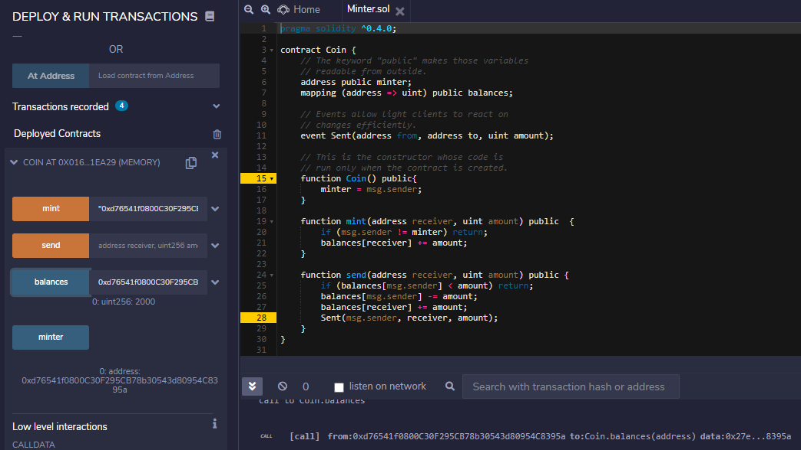
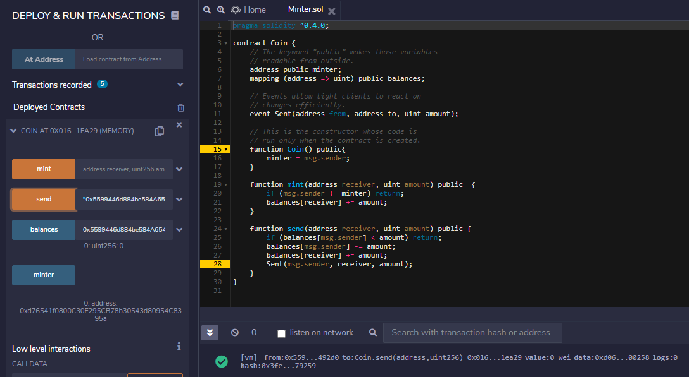

# Smart-Contracts
- **To get started with Smart Contracts I created a basic Smart Contract Bider which I have coded in Solidity Language and run the same on Remix IDE**
- Following functions are implemented in Bider.sol :
   - [x] **setName** which sets the name of the bider.
   - [x] **setBidAmount** which sets the bidAmount from the bider.
   - [x] **determineEligibility** which determines the eligibility of the bider to perform the biding.
   
 
  
 

- **To go further and to know about Solidity Language and to get familiar with it's Data Types I coded next Program Minter.sol**
- Following functions are implemented in Minter.sol :
   - [x] **sent** which is an event that specifies the details of transacting minters address, the balance and address of the sender.
   - [x] **Coin** which assigns minter the address of the sender.
   - [x] **mint** which checks if the adrresses of sender and minter are different and also updates the balances.
   - [x] **send** which performs transaction and checks and updates the balances of sender and receiver.
 
 
 
 
 
 
